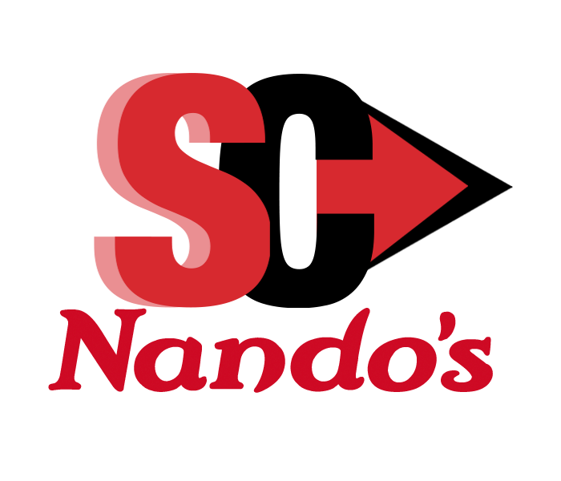

# Project for: Multiverse Deployment Module

## 🚀 Mission
Deliver solutions to facilitate robust and accurate flow of product and information to and from suppliers to restaurants and platforms - to minimise costs, effort and to ensure our customers safety while providing all the meals they love

## 🏄 Vision
A world in which Nando’s is unconstrained in choosing the best suppliers to support its growth, dynamic menu and Net Zero commitments and, without stress, our restaurants always have the ideal stock levels and Central Support has a total understanding of the state of the business

## 🏋🏽 Personal Goal
To demosntrate actitud, aptitud, capabilities and skills aquiered during the apprenticeship

## 🧭 How to use
- npm install to install all dependencies
- npm run start
- or
- npm run server (For development)

## 🛠️ My Tools
- MongoDB / Express / JS 
- Terraform
- Google Cloud Platform